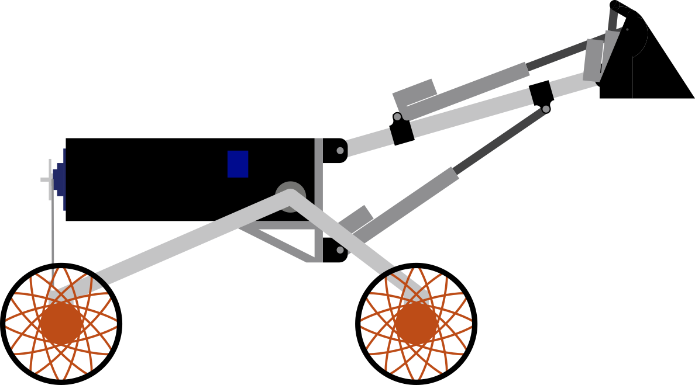

# Welcome to Perseus-v3!

Welcome! This is the home of the Perseus Rover documentation. It contains (well, it should, if people have been updating it) everything you need to know about developing on the rover. If you are looking to follow and keep up with the ROAR team check out or socials: [LinkedIn](https://www.linkedin.com/company/roar-team/), [Instagram](https://www.instagram.com/qutroarteam?igsh=MXdzbXo4azY5cHhtMw==) or join our parent club the [QUT Robotics Club](https://linktr.ee/qutroboticsclub).

If you're new here, you'll probably be wanting to read through the [Getting Started](../02-perseus-v3/01-getting-started/index.md) page, which contains everything you need to know to get yourself set up to start writing code.
Alternatively, if you're instead arms-deep in the rover's guts and wondering where that wire goes, or you're interested in designing electronics to go on-board the rover, check out the [hardware system](./08-hardware/index.md).
Finally, if you're wondering what a specific bit of code does, you probably want look over the [software system](./05-software/index.md).

## Conventions

### File Paths

Unless otherwise specified, file paths are relative to the repository root.

!!! example
    
    If you checked out the repository in your home directory at `~/perseus-v2`, `devenv.nix` (our main configuration file!) would refer to `~/perseus-v2/devenv.nix`.

